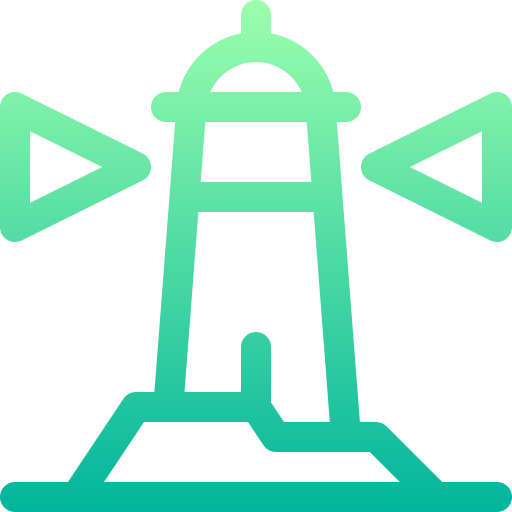

<!-- PROJECT SHIELDS -->

[![Contributors][contributors-shield]][contributors-url]
[![Forks][forks-shield]][forks-url]
[![Stargazers][stars-shield]][stars-url]
[![Issues][issues-shield]][issues-url]
[![Unlicense License][license-shield]][license-url]
[![LinkedIn][linkedin-shield]][linkedin-url]

<!-- PROJECT LOGO -->

<br />
<div align="center">
  <a href="https://github.com/llamp-ai/llamphouse">
    
  </a>

<h3 align="center">LLAMPHouse</h3>

<p align="center">
    Serving Your LLM Apps, Scalable and Reliable.
    <br />
    <a href="https://github.com/llamp-ai/llamphouse/tree/main/docs"><strong>Explore the docs »</strong></a>
    <br />
    <br />
    <a href="#quickstart">Quickstart</a>
    ·
    <a href="https://github.com/llamp-ai/llamphouse/issues/new?labels=bug&template=bug-report---.md">Report Bug</a>
    ·
    <a href="https://github.com/llamp-ai/llamphouse/issues/new?labels=enhancement&template=feature-request---.md">Request Feature</a>
  </p>
</div>

---

## What is LLAMPHouse?

LLAMPHouse is a **self-hosted, production-ready server** for LLM-powered applications. It exposes an **OpenAI-compatible Assistants API** and supports the **A2A (Agent-to-Agent) protocol** — so you can use the standard OpenAI Python SDK or any A2A client to talk to your agents.

> [!NOTE]
> A2A protocol support requires LLAMPHouse **v1.2.0** or later. Earlier versions only support the OpenAI Assistants API adapter.

Write your agent logic in plain Python, plug it into LLAMPHouse, and get:

- 🔌 **OpenAI-compatible API** — drop-in replacement, use the `openai` Python SDK as the client
- 🤝 **A2A protocol** — interoperable agent-to-agent communication out of the box
- 🌊 **Streaming** — real-time token streaming with SSE (works with OpenAI, Gemini, Anthropic)
- 🛠️ **Tool calls** — native support for function calling with automatic tool output handling
- 🔀 **Multi-agent** — `call_agent()` and `handover_to_agent()` for orchestration and delegation
- 📊 **Compass dashboard** — built-in dev UI for threads, messages, runs, traces, and agent flow visualization
- 🔍 **OpenTelemetry tracing** — automatic distributed tracing with ClickHouse storage
- ⚙️ **Config store** — runtime-tunable agent parameters via a dashboard UI
- 🐘 **Pluggable storage** — in-memory (default) or Postgres, with Alembic migrations
- 🐳 **Docker-ready** — single-command deployment with Postgres, Redis, and tracing

---

## Why LLAMPHouse?

Most agent frameworks focus on *building* agents — LLAMPHouse focuses on **serving** them. Here's why that matters:

### 🚀 Scales from dev to production without rewrites

Start with a single Python file and an in-memory store. When you're ready for production, add Postgres, Redis, and distributed workers — same agent code, zero rewrites. LLAMPHouse grows with your project.

### 📦 Workload scaling, not agent scaling

Traditional setups tie one process to one agent. LLAMPHouse uses a **shared agent pool** with a run queue — multiple agents share the same infrastructure, and workers pull from a common queue. Scale by adding workers, not by duplicating services per agent.

### 🔧 Easily extensible and configurable

Swap out any component to fit your use case: data stores, queues, event queues, authentication, adapters, and workers are all pluggable interfaces. Need a custom auth layer? Implement `BaseAuth`. Want Redis queues? Drop in `RedisQueue`. The framework adapts to you, not the other way around.

### 🧩 LLM and framework agnostic

LLAMPHouse doesn't care what happens inside your `run()` method. Use **OpenAI**, **Anthropic**, **Google Gemini**, **Azure AI**, or any other provider. Build with **LangChain**, **LangGraph**, **LlamaIndex**, **CrewAI**, or plain API calls — LLAMPHouse serves the result, regardless of what generated it.

### 🌐 Standards-based interoperability

Expose your agents via the **OpenAI Assistants API** (works with the `openai` Python SDK out of the box) and the **A2A protocol** (Google's Agent-to-Agent standard). Your agents are instantly accessible to any compatible client or agent ecosystem.

---

## Quickstart

**Requirements:** Python 3.10+

### 1. Install

```bash
pip install llamphouse
```

### 2. Create your agent

Create a file called `server.py`:

```python
from llamphouse.core import LLAMPHouse, Agent
from llamphouse.core.context import Context
from llamphouse.core.data_stores.in_memory_store import InMemoryDataStore
from llamphouse.core.adapters.a2a import A2AAdapter


class HelloAgent(Agent):
    async def run(self, context: Context):
        await context.insert_message(
            "Hello! I'm a simple agent running on LLAMPHouse."
        )


agent = HelloAgent(
    id="hello-agent",
    name="Hello Agent",
    description="A friendly assistant that answers questions.",
    version="0.1.0",
)

app = LLAMPHouse(
    agents=[agent],
    data_store=InMemoryDataStore(),
    adapters=[A2AAdapter()],
)

app.ignite(host="127.0.0.1", port=8000)
```

### 3. Run it

```bash
python server.py
```

Your agent is now live at `http://127.0.0.1:8000` with:
- **A2A protocol** at `/.well-known/agent.json`
- **Compass dashboard** at `http://127.0.0.1:8000/compass`

### 4. Talk to it

Use any A2A client, the OpenAI Python SDK, or just curl:

```bash
# Create a thread
curl -s -X POST http://127.0.0.1:8000/threads | python3 -m json.tool

# Send a message and create a run
THREAD_ID="<thread_id from above>"
curl -s -X POST "http://127.0.0.1:8000/threads/$THREAD_ID/messages" \
  -H "Content-Type: application/json" \
  -d '{"role": "user", "content": "Hi there!"}'

curl -s -X POST "http://127.0.0.1:8000/threads/$THREAD_ID/runs" \
  -H "Content-Type: application/json" \
  -d '{"assistant_id": "hello-agent"}'
```

Or use the **OpenAI SDK** as a client:

```python
from openai import OpenAI

client = OpenAI(base_url="http://127.0.0.1:8000", api_key="any")

thread = client.beta.threads.create()
client.beta.threads.messages.create(
    thread_id=thread.id, role="user", content="Hello!"
)
run = client.beta.threads.runs.create(
    thread_id=thread.id, assistant_id="hello-agent"
)
```

---

## Adding an LLM

Connect to any LLM provider. Here's an example with OpenAI:

```python
from dotenv import load_dotenv
from openai import AsyncOpenAI
from llamphouse.core import LLAMPHouse, Agent
from llamphouse.core.context import Context
from llamphouse.core.data_stores.in_memory_store import InMemoryDataStore
from llamphouse.core.adapters.a2a import A2AAdapter

load_dotenv()
openai_client = AsyncOpenAI()


class ChatAgent(Agent):
    async def run(self, context: Context):
        messages = [
            {"role": m.role, "content": m.text}
            for m in context.messages
        ]
        result = await openai_client.chat.completions.create(
            messages=messages, model="gpt-4o-mini",
        )
        await context.insert_message(result.choices[0].message.content)


app = LLAMPHouse(
    agents=[ChatAgent(
        id="chat", name="Chat Agent",
        description="Chat with GPT", version="0.1.0",
    )],
    data_store=InMemoryDataStore(),
    adapters=[A2AAdapter()],
)
app.ignite(host="127.0.0.1", port=8000)
```

---

## Key Concepts

### Agent

An agent is a Python class that subclasses `Agent` and implements a `run()` method. This is where your logic lives — call LLMs, use tools, delegate to other agents, or do anything you need.

```python
class MyAgent(Agent):
    async def run(self, context: Context):
        # context.messages — the conversation history
        # context.insert_message("...") — send a reply
        # context.send_chunk("...") — stream a token
        # context.call_agent("other-agent", "question") — call another agent
        # context.handover_to_agent("other-agent", "question") — hand off entirely
        # context.get_config("param_name") — read runtime config
        pass
```

### Context

The `Context` object is passed to every `run()` call and provides the full toolkit:

| Method | Description |
|---|---|
| `context.messages` | Conversation history for the current thread |
| `context.insert_message(text)` | Insert an assistant reply |
| `context.send_chunk(text)` | Stream a text chunk to the client |
| `await context.call_agent(agent_id, message)` | Call another agent, returns an async generator of chunks |
| `await context.handover_to_agent(agent_id, message)` | Hand off the conversation to another agent |
| `context.get_config(key)` | Read a runtime config parameter |
| `context.submit_tool_outputs(run_id, outputs)` | Submit tool call results back to a run |

### Adapters

Adapters control how clients communicate with your agents:

| Adapter | Protocol | Use case |
|---|---|---|
| `A2AAdapter` | A2A (Agent-to-Agent) | Interoperable agent communication |
| `AssistantAPIAdapter` | OpenAI Assistants API | OpenAI SDK compatibility |

Both can be used simultaneously. If no adapters are specified, `AssistantAPIAdapter` is used by default.

### Multi-Agent

LLAMPHouse supports multiple agents in a single server. Agents can call each other directly — no HTTP overhead:

```python
# In an orchestrator agent's run() method:

# Option 1: Call another agent and forward its response chunks
async for chunk in await context.call_agent("researcher", "Find info about X"):
    context.send_chunk(chunk)

# Option 2: Hand off the entire conversation
await context.handover_to_agent("specialist", "Handle this request")
```

---

## Configuration

### LLAMPHouse constructor

```python
LLAMPHouse(
    agents=[...],                  # List of Agent instances
    adapters=[A2AAdapter()],       # Protocol adapters (default: AssistantAPIAdapter)
    data_store=InMemoryDataStore(),# In-memory (default) or PostgresDataStore
    authenticator=KeyAuth("key"),  # Optional API key auth
    config_store=None,             # Optional runtime config store
    retention_policy=None,         # Optional data retention/purge policy
    exclude_spans=["pattern.*"],   # Optional tracing span exclusions
    compass=True,                  # Enable/disable Compass dashboard (default: True)
)
```

### Environment variables

| Variable | Description | Default |
|---|---|---|
| `DATABASE_URL` | Postgres connection string | _(in-memory if unset)_ |
| `REDIS_URL` | Redis URL for queues | _(in-memory if unset)_ |
| `LLAMPHOUSE_TRACING_ENABLED` | Enable OpenTelemetry tracing | `true` |
| `OTEL_EXPORTER_OTLP_ENDPOINT` | OTLP collector endpoint | _(none)_ |
| `OTEL_SERVICE_NAME` | Service name for traces | `llamphouse` |
| `CLICKHOUSE_URL` | ClickHouse URL for Compass traces view | _(none)_ |

---

## Examples

The [examples/](examples/) directory contains runnable samples for every feature:

| Example | Description |
|---|---|
| [01_HelloWorld](examples/01_HelloWorld/) | Minimal agent — no LLM needed |
| [02_Chat](examples/02_Chat/) | OpenAI-powered conversational agent |
| [03_Streaming](examples/03_Streaming/) | Real-time token streaming with SSE |
| [04_ToolCall](examples/04_ToolCall/) | Function calling with tool schemas |
| [06_GeminiStreaming](examples/06_GeminiStreaming/) | Streaming with Google Gemini |
| [08_Tracing](examples/08_Tracing/) | OpenTelemetry distributed tracing |
| [09_A2A](examples/09_A2A/) | A2A protocol agent |
| [10_A2A_ToolCall](examples/10_A2A_ToolCall/) | A2A with tool calls |
| [11_AgentHandover](examples/11_AgentHandover/) | Multi-agent handover |
| [12_CentralOrchestrator](examples/12_CentralOrchestrator/) | Central orchestrator pattern |
| [13_ConfigStore](examples/13_ConfigStore/) | Runtime-tunable agent config |
| [14_DistributedWorker](examples/14_DistributedWorker/) | Separate API and worker processes |
| [15_A2A_AIFoundry](examples/15_A2A_AIFoundry/) | A2A with Azure AI Foundry |
| [LangGraph](examples/LangGraph/) | LangGraph integration |

Each example includes a `server.py`, `client.py`, and `README.md` with instructions.

---

## Docker Deployment

A Docker Compose setup is included for production deployments with Postgres, Redis, OpenTelemetry, and ClickHouse:

```bash
cd docker
docker compose up -d
```

This starts:

| Service | Port | Purpose |
|---|---|---|
| **Runtime** | `8080` | Your agent server |
| **Postgres** | `5432` | Persistent data store |
| **Redis** | `6379` | Run queue and event queue |
| **OTel Collector** | `4318` | Trace collection |
| **ClickHouse** | `8123` | Trace storage for Compass |

For split-mode deployments (separate API and worker processes), see `docker-compose.prod.yml`.

---

## Development

### Setup

```bash
git clone https://github.com/llamp-ai/llamphouse.git
cd llamphouse
python -m venv .venv && source .venv/bin/activate
pip install -e ".[dev]"
```

### Testing

```bash
# Run all tests (unit + contract + integration)
python -m pytest tests/ -v

# Postgres-only tests (requires DATABASE_URL)
python -m pytest -m postgres
```

### Database Migrations (Postgres only)

LLAMPHouse uses Alembic for schema migrations:

```bash
# Start a local Postgres
docker run --rm -d --name postgres \
  -e POSTGRES_USER=postgres -e POSTGRES_PASSWORD=password \
  -p 5432:5432 postgres
docker exec -it postgres psql -U postgres -c 'CREATE DATABASE llamphouse;'

# Apply migrations
alembic upgrade head

# Create a new migration
alembic revision --autogenerate -m "description"

# Roll back
alembic downgrade base
```

### Building

```bash
python -m build
```

---

## API Compatibility

LLAMPHouse implements the [OpenAI Assistants API v2](https://platform.openai.com/docs/api-reference/assistants):

| Endpoint | Status |
|---|---|
| **Assistants** — List, Retrieve | ✅ |
| **Assistants** — Create, Modify, Delete | _By design: agents are defined in code_ |
| **Threads** — Create, Retrieve, Modify, Delete | ✅ |
| **Messages** — Create, List, Retrieve, Modify, Delete | ✅ |
| **Runs** — Create, Create thread & run, List, Retrieve, Modify, Cancel, Submit tool outputs | ✅ |
| **Run Steps** — List, Retrieve | ✅ |
| **Streaming** — Message delta, Run step, Assistant stream | ✅ |
| **Vector Stores** | _Not yet implemented_ |

---

## Contributing

Contributions are welcome! If you have a suggestion, please fork the repo and create a pull request, or open an issue with the tag "enhancement".

1. Fork the Project
2. Create your Feature Branch (`git checkout -b feature/AmazingFeature`)
3. Commit your Changes (`git commit -m 'Add some AmazingFeature'`)
4. Push to the Branch (`git push origin feature/AmazingFeature`)
5. Open a Pull Request

### Top contributors:

<a href="https://github.com/llamp-ai/llamphouse/graphs/contributors">
  
</a>

## License

See [`LICENSE`](LICENSE) for more information.

## Contact

Project Admin: Pieter van der Deen — [pieter@stack-wise.co.uk](mailto:pieter@stack-wise.co.uk)

<!-- MARKDOWN LINKS & IMAGES -->

[contributors-shield]: https://img.shields.io/github/contributors/llamp-ai/llamphouse?style=for-the-badge
[contributors-url]: https://github.com/llamp-ai/llamphouse/graphs/contributors
[forks-shield]: https://img.shields.io/github/forks/llamp-ai/llamphouse?style=for-the-badge
[forks-url]: https://github.com/llamp-ai/llamphouse/network/members
[stars-shield]: https://img.shields.io/github/stars/llamp-ai/llamphouse.svg?style=for-the-badge
[stars-url]: https://github.com/llamp-ai/llamphouse/stargazers
[issues-shield]: https://img.shields.io/github/issues/llamp-ai/llamphouse.svg?style=for-the-badge
[issues-url]: https://github.com/llamp-ai/llamphouse/issues
[license-shield]: https://img.shields.io/github/license/llamp-ai/llamphouse.svg?style=for-the-badge
[license-url]: https://github.com/llamp-ai/llamphouse/blob/master/LICENSE
[linkedin-shield]: https://img.shields.io/badge/-LinkedIn-black.svg?style=for-the-badge&logo=linkedin&colorB=555
[linkedin-url]: https://linkedin.com/in/pieter-vdd
